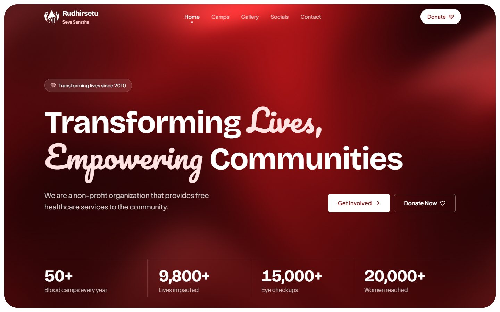

# Rudhirsetu Seva Sanstha website

The official website of **Rudhirsetu Seva Sanstha**, an Indian non-profit that has organised blood donation camps, emergency blood support and free health camps (eye care, cancer awareness, thalassemia support) since 2010. *Rudhirsetu* means "bridge of blood".

The site is for donors, volunteers, patients' families and partners. Visitors can find upcoming and past camps, browse photos, donate by UPI or bank transfer, get in touch and follow the organisation on social media. The NGO's own staff keep all of that content up to date through a CMS, with no code involved.



## Pages

| Route | Page |
| --- | --- |
| `/` | Home: hero, focus areas, upcoming events, impact, featured photos, contact and map |
| `/camp` | Upcoming and past camps and events |
| `/event/[id]` | One event, with its gallery |
| `/gallery` | Photo gallery with category filters |
| `/donations` | UPI, bank transfer and Section 80G tax information |
| `/contact` | Contact details, emergency line and map |
| `/social` | Social media links |

## Tech stack

- **Next.js 16** (App Router, Turbopack), **React 19**, **TypeScript**
- **Tailwind CSS v4** (CSS-first `@theme` in `src/styles/globals.css`), **Framer Motion**, **Lenis**
- **Sanity** CMS (`@sanity/client`); content pages are static with on-demand revalidation by webhook
- Deployed on **Vercel** (Vercel Analytics and Speed Insights)
- Jest and Playwright for tests

## Quick start

You need **Node.js 22 LTS** (Next.js 16 needs at least 20.9) and **[Bun](https://bun.sh)** (the package manager; production installs with it too).

```bash
git clone <repository-url>
cd Rudhirsetu-website
bun install
cp .env.example .env.local        # PowerShell: Copy-Item .env.example .env.local
bun run dev
```

Open http://localhost:3000.

Edit `.env.local` so it contains at least:

```bash
NEXT_PUBLIC_SANITY_PROJECT_ID=<the Sanity project id>
NEXT_PUBLIC_SANITY_DATASET=production
NEXT_PUBLIC_SANITY_API_VERSION=2024-03-14
NEXT_PUBLIC_BASE_URL=http://localhost:3000
SANITY_REVALIDATE_SECRET=<any long random string>
```

`.env.example` lists them all with comments. `NEXT_PUBLIC_BASE_URL` and `SANITY_REVALIDATE_SECRET` are needed for correct canonical and share URLs and for testing the revalidation webhook. Without `NEXT_PUBLIC_SANITY_PROJECT_ID` the app will not start. All variables are explained in [docs/ARCHITECTURE.md](./docs/ARCHITECTURE.md#5-environment-variables).

## Scripts

| Command | What it does |
| --- | --- |
| `bun run dev` | Start the dev server (Turbopack) on port 3000 |
| `bun run build` | Production build (fails on type errors; needs network access) |
| `bun run start` | Serve the production build |
| `bun run lint` | ESLint |
| `bun run analyze` | Bundle analyzer (`next experimental-analyze`) |
| `bun run test` | Jest unit tests (none written yet) |
| `bun run test:e2e` | Playwright end-to-end tests (run `npx playwright install` once first) |

See [docs/ARCHITECTURE.md, "Scripts and testing"](./docs/ARCHITECTURE.md#11-scripts-and-testing) for details and known test issues.

## Project layout

```
src/app/         routes: page.tsx (server) -> <Route>Client.tsx -> src/views/<View>.tsx
src/views/       page UI
src/components/  shared components (ui/, contact/, donations/, events/, gallery/)
src/lib/         Sanity client, GROQ queries, data helpers, SEO and JSON-LD
src/services/    browser-side Sanity helpers (pagination)
public/          images, icons, help page, robots.txt, sitemap.xml
docs/            documentation
```

## Documentation

| Read | For |
| --- | --- |
| [docs/README.md](./docs/README.md) | Index and reading order |
| [docs/ARCHITECTURE.md](./docs/ARCHITECTURE.md) | How the site works: data flow, caching, the Sanity webhook, performance decisions, SEO, deployment, how-tos, troubleshooting |
| [docs/DESIGN.md](./docs/DESIGN.md) | UI design system and rules |
| [docs/BRAND.md](./docs/BRAND.md) | Brand kit: logo, colour, type, voice, imagery |
| [docs/CONTENT.md](./docs/CONTENT.md) | Guide for editing content in Sanity |

## For NGO staff

You edit the website in **Sanity Studio** at https://rudhirsetu.sanity.studio. Start with the [content guide](./docs/CONTENT.md) (events, gallery, donation, contact and social settings, image sizes, how long changes take), or open the printable help page at `/help.html` on the live site (`public/help.html`). Remember to press **Publish** after every change.

## Deployment

The site deploys to Vercel. Set the five environment variables above (with the real production origin in `NEXT_PUBLIC_BASE_URL`) and create the Sanity webhook that calls `/api/revalidate`. The exact steps are in [docs/ARCHITECTURE.md, "Deployment on Vercel"](./docs/ARCHITECTURE.md#12-deployment-on-vercel) and ["Sanity webhook setup"](./docs/ARCHITECTURE.md#46-isr-tags-and-the-webhook).

## Contributing

- Read [docs/DESIGN.md](./docs/DESIGN.md) before writing UI. The site must work in Chrome, Firefox, Safari (macOS and iOS) and Android browsers; avoid `backdrop-filter` and opacity-based scroll reveals (they measurably hurt scrolling performance in Firefox).
- Do not edit generated or ignored output (`.next/`, `coverage/`).
- Update the relevant document in `docs/` when you change behaviour it describes.
